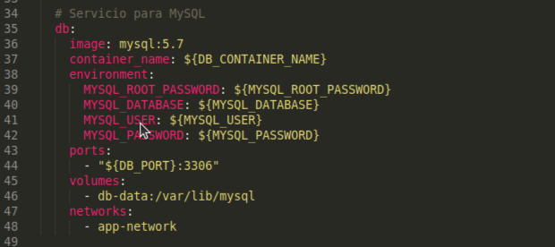
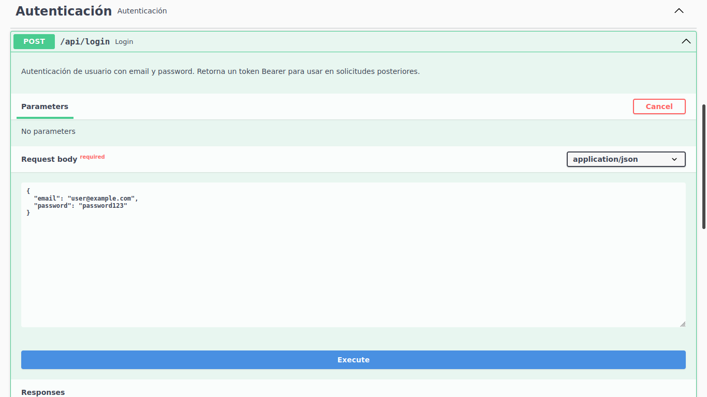

# Despliegue de API Laravel 8 con Docker

## Requisitos previos

Tener instalados:

- Docker
- Docker Compose

## Estructura del proyecto

```
project-root/
├── images/
├── docker-compose.yml
├── Dockerfile
├── src/            # Código de la aplicación Laravel
├── .env            # Variables de entorno para Docker
├── nginx/
│   └── default.conf # Configuración de nginx
```

## Pasos para desplegar

### 1. Clonar el repositorio

```bash
git clone https://github.com/jmcabo93/laravel_docker.git
cd laravel_docker
```

### 2.Configurar archivo `.env`

```
# Nombres de contenedores
APP_CONTAINER_NAME=laravel-app
NGINX_CONTAINER_NAME=nginx-server
DB_CONTAINER_NAME=mysql-db

# Puertos
NGINX_PORT=80
DB_PORT=3306

# La configuración de la base de datos en docker-compose.yml debe coincidir con la del archivo .env de Laravel
MYSQL_ROOT_PASSWORD=root
MYSQL_DATABASE=laravel
MYSQL_USER=admin
MYSQL_PASSWORD=123456
```

### 3. Construir e iniciar los contenedores

Ejecuta el comando 

```bash
docker-compose up -d --build
```


### 4. Instalar dependencias de laravel y configuración de archivo .env

Ejecuta el comando 

```bash
docker exec -it laravel-app bash
```

```bash
composer install
cp .env.example .env
php artisan key:generate
chmod -R 755 /var/www
chown -R www-data:www-data /var/www/storage /var/www/bootstrap/cache
```
Configura el .env  de Laravel como se explicó en el segundo punto y muy importante que el **DB_HOST** sea igual a como se definió el servicio para base de datos en el docker-compose.yml, en este caso sería **db**



### 5. Acceder a la aplicación

```
http://localhost
```

### 6. Laravel Breeze

Se utilizó **Laravel Breeze** para generar todo lo relacionado con el proceso de inicio de sesión y registro de usuarios.

### 7. Ejecutar comandos de Laravel

Para crear la base de datos ejecuta:
```bash
php artisan migrate
```
Para insertar en la base de datos categorías y productos ejecuta:
```bash
php artisan db:seed
```
Para adicionar productos desde una API externa (https://fakestoreapi.com/products) ejecuta:
```bash
php artisan cargar:productos
```

### 8. Seguridad

La API ha sido desarrollada utilizando **Laravel Sanctum** para la creación de tokens de autenticación. Todas las rutas están protegidas mediante **JWT (JSON Web Token)**, y es necesario incluir la directiva `Bearer <token>` en el encabezado de las solicitudes para acceder a los endpoints protegidos.
Se debe haber registrado previamente en el sistema para después autenticarse en la API y obtener el token que le dará acceso.
Puede registrarse en 
```
http://localhost/register
```




### 9. Documentación de la API usando Swagger

Puedes visualizar todos los endpoints disponibles y comprobar su funcionamiento en la url:

```
http://localhost/api/documentation
```


### 10. Detener los contenedores

Para detener los contenedores en ejecución, usa:

```bash
docker-compose down
```
Si los quieres levantar solamente sin reconstruirlos: 

```bash
docker-compose up -d
```